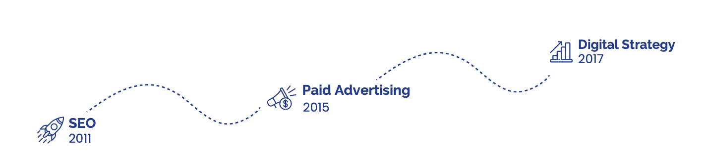

# 👨‍💻  Ahoy There, sono Albo
Possiedo competenze IT e una visione strategica per raggiungere obiettivi aziendali e digitali complessi. 
Il mio approccio è **data-driven e tecnico**, spaziando dalla progettazione di strategie allo sviluppo web.

## 🧰 Le Mie Competenze:
- Creo e definisco strategie di marketing mirate al raggiungimento di obiettivi aziendali specifici (adottando metodologie come **PURE, CLEAR, SMART & DUMB**).
- Sviluppo siti web orientati agli obiettivi di marketing, sfruttando a fondo **CMS monolitici**
- Gestisco campagne pubblicitarie su piattaforme quali **Google Ads e Meta**, focalizzandomi sull'ottimizzazione delle performance e del ROI.
- Incremento la visibilità online e le performance dei siti web usando strumenti di **Technical SEO**

## 🧪 Il Mio Approccio
- Integro abilità tecnologiche con strategie di marketing mirate.
- Non mi considero solo un consulente di Marketing o uno specialista IT, ma piuttosto una fusione di entrambi.
- Prendo decisioni basate su analisi approfondite e dati concreti, per guidare la creazione e l'attuazione di campagne efficaci.
- Collaboro sia con team IT che con team creativi per assicurare che le soluzioni siano praticabili, in linea con gli obiettivi aziendali e le esigenze del cliente.

## 📝 Percorso
Ho iniziato come **SEO** nel 2011. Ho proseguito poi specializzandomi in competenze di **strategia e perfomance**, preferendo l'ambito IT a quello meramente creativo. 

  

